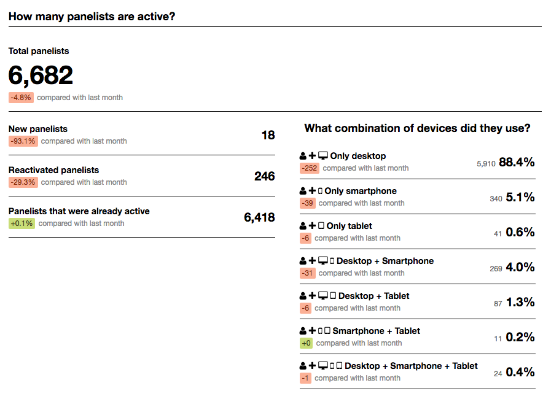
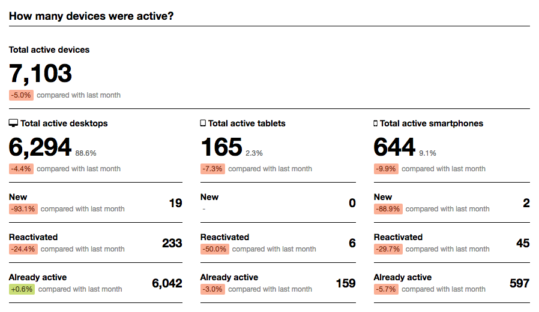

# Panel



\newpage



# Data and varables exaple

\newpage

``` {r Desktop_data, echo=FALSE, size='tiny'}

print(export_files$desktop_example)

```


\newpage

``` {r Mobile_data, echo=FALSE, size='tiny'}

print(export_files$mobile_example)

```


# Analysis

The following section contains an explanation of the main techniques performed during the analysis along with their assumptions, followed by the results of the ordinary least squares  diagnostic tests of the restricted model. Once the functional form of the restricted model has been selected I proceed with variable selection in order to come up with the final model. Finally, I ran the diagnostics of tests over the final model again.     

## Factor Analysis

Factor analysis is a widely used technique used for explaining the variance in several variables by a smaller set of latent variables. As in the current case, it is often used to consolidate several survey variables onto their "underlying" factors in order to reduce the dimensionality of the data. Factor analysis groups variables together, that is, using a lot of variables one can potentially reduce them to certain factors representing the latent underlying factors representing them by accounting the similar patterns in the variables. The intuition behind the analysis is as follows. The analysis groups together observed, correlated variables into smaller groups of unobserved (latent) variables [@yong2013beginner]. 

In this case, I use factor analysis to to reduce the seven survey items regarding the risk and uncertainty attitude down to two constructs namely risk and uncertainty. Also to reduce the eleven-item scale of BIG5 to 5 factors representing each of on the of the five personality traits.


## Regression Analysis
 
For testing the hypotheses of this paper, regression analysis will be utilized. The regression model or ordinary least squares (hereafter OLS) is the "cornerstone of econometrics" [@verbeek2008guide]. It aims at explaining a variable, y, in terms of another variable, x. In other words, using OLS researchers are able to find how will y vary as x changes, the ultimate goal being to infer the causal effect x has on y. Using such models allows to find relationships between various variables, present the effect the independent variables, xi has on the dependent variable, y in order to be able to make predictions.
 
The general linear regression models is represented as follows:
            
$$ y = \beta_{0} + X_{1}\beta_{1} + X_{2}\beta_{2} + ... + X_{k}\beta_{k} + \varepsilon $$

Where:
$y$ is the dependent variable 

$X_{1}$ to $X_{k}$ are the independent variables, which explain $y$

$\beta_{0}$ is the intercept, indicating the expected value of $y$ when all the independent variables are equal to 0

$\beta_{1}$ to $\beta_{k}$  are the coefficients which determine the effect $x$ has on $y$

$\varepsilon$ is the error term

### Goodness of fit and model selection

The standard measures of fit include the R-squared and the adjusted R-squared, which measures the variance that is explained in the model for the independent variable by the dependent variables.  The measure can be interpreted directly. For example, if the R-squared is equal to 0.45, it means that the variables included in the model explain 45% of the variation of the independent variable, y. The higher the value, the higher its predictive power. However, it should be noted that adjusted R-squared penalizes for the additional number of parameters. Thus, applying additional variables to the model, I should test if they are jointly significant in order to assess whether they are relevant or not in the model.This is typically applied by using the F-test (Wald test). Using both the R-squared, the overall F-test and applying the F-test to certain variables I can compare best which model fits the data best.

### Akaike information criterion (AIC)

Model selection has been done over Akaike information criterion (AIC) introduced by <!--  -->@akaike1974new. AIC is a metric traditionally used for model selection. It compares the goodness of fit for a number of explanatory variables and penalizes for each additional explanatory variable.

### BLUE Assumptions

There are several assumptions that need to be met when applying OLS explained in the section below. Namely Gauss-Markov assumptions for full ideal conditions for OLS. The model needs to be best linear unbiased estimator" ("BLUE") [@verbeek2008guide]. It is crucial for the assumptions to be met as to compute unbiased and consistent estimates that explain the variation  in the dependent variable. Now, I will go through each assumption:
Linear in parameters
This implies that the model should have linear parameters, b, however, there can be nonlinearities in the variables, x. This assumption is met as my specified model does not include non-linearities in the parameters.

##### Normality

The error terms should follow a normal distribution. In large datasets, however, even if the error term does not follow a normal distribution the regression estimators are 'asymptotically normally distributed', meaning that following non-normal distribution is not crucial as the estimates will still be consistent and unbiased. The Shapiro-Wilk test can is adopted here and results presented below. The test works under null hypothesis: "the sample comes from normally distributed population" <!-- -->@shapiro1965analysis


### Random sample

The data collection should be done randomly, meaning that the each subject should have the same probability of being selected. In this research, both in the behavioral and survey data collection parts, I can say that subjects were randomly selected for further analysis.

### Multicollinearity

Multicollinearity implies that there is no perfect linear relationship between the independent (explanatory) variables as this can lead to 'unreliable regression estimated' [@verbeek2008guide]. For example, adding both male and female in the analysis would lead to perfect collinearity (as male + female =1) and the estimations would not work. In this example, removing one of the variables would solve the problem, however, there can be other variables that are highly correlated. Having multicollinearity would not lead to biased estimates, but to inaccurate estimates. In such a case, excluding variables from the model should be considered. There are no tests that specifically look for multicollinearity, however, there are certain indications. For instance, having two variables that are jointly significant (have big F-statistics), but independently are not significant can be a sign of multicollinearity 

### Homoscedasticity

Homoscedasticity implies that the variance of the error term should be the same for all values of the independent variables. If this does not hold, there is a problem with heteroscedasticity meaning that the estimates of the regression are inconsistent due to an inaccuracy of their standard errors, meaning that the t-statistics and thus the significance level of the estimates are not valid anymore.  To test for homoscedasticity, I perform the Breusch-Pagan test, which hypothesizes that there is a constant variance of the error terms. 

### Endogeneity

The last assumption is crucial to be met as otherwise, the regression estimates are biased and inconsistent. Endogeneity implies that there is a correlation between an independent variable and the error term. There are several reasons why this assumption does not fold:

1. The model is misspecified. That is, nonlinearities are missing from the model or interaction effects are not accounted for. To account for that I perform the Ramsey-Reset test. The tests add fitted values on power and re-estimates the model. The intuition behind it is that if a nonlinear combination of independent variables can explain the dependent variable there are evidence the model is misspecified.  The Ramsey-Reset test work under null hypothesis that the model has no important omitted non-linearities <!--  -->[@ramsey1974classical]
2. Endogeneity, meaning that we are either missing important variables that explain the variance in the independent variables or we have reverse causality, that means that there can be a loop of causality between the independent and dependent variable.

### Stepwise regression

The idea of stepwise regression has been introduced by <!--  -->@hastie1992statistical and further improved by <!--  -->@ripley2002modern. It is an iterative function ran over a restricted model and a set of candidate models. Each candidate model consists of a different set of explanatory variables. The function computes iteratively Akaike information criterion (AIC) values for the models comparing them to the best performing models from the previous iteration and based on the performance chooses whether to continue the loop with the new model or remain with the old one. The final output is the best performing model.

# Results

## Factor analysis

``` {r echo=FALSE, size = "tiny"}
print(export_files$RAUA_factor, digits = 2, cutoff = .4, sort = FALSE)
```


\newpage

``` {r echo=FALSE, size = "tiny"}
print(export_files$big5_factor, digits = 2, cutoff = .4, sort = FALSE)
```


## OLS

\newpage

``` {r echo=FALSE, message = FALSE, results = 'asis'}

stargazer(export_files$ols$restricted_desktop_11,
          export_files$ols$restricted_desktop_12,
          export_files$ols$restricted_desktop_13,
          export_files$ols$restricted_desktop_14,
          export_files$ols$restricted_desktop_15, 
          type = "latex",
          title = "Desktop data, restricted model",
          font.size = "small",
          digits = 2,
          header=FALSE,
          dep.var.labels = c("log(MM)","log(Domains)","log(PV)","log(Time)","log(Length)"),
          covariate.labels = c("Risk:seek","Uncertainty:seek","Days","D MM","D Domains",
                                                   "D PV","D Time","D Length","D Purchase","Risk x Uncertainty"))


```

\newpage

``` {r echo=FALSE, message = FALSE, results = 'asis'}

stargazer(export_files$ols$restricted_mobile_11,
          export_files$ols$restricted_mobile_12,
          export_files$ols$restricted_mobile_13,
          export_files$ols$restricted_mobile_14,
          export_files$ols$restricted_mobile_15,
          type = "latex",
          title = "Mobile data, restricted model",
          font.size = "small",
          digits = 2,
          header=FALSE,
          dep.var.labels = c("log(MM)","log(Domains)","log(PV)","log(Time)","log(Length)"),
          covariate.labels = c("Risk:seek","Uncertainty:seek","Days","D MM","D Domains",
                                                   "D PV","D Time","D Length","Risk x Uncertainty"))

```


\newpage

``` {r echo=FALSE, message = FALSE, results = 'asis'}

stargazer(export_files$ols$restricted_combined_11,
          export_files$ols$restricted_combined_12,
          export_files$ols$restricted_combined_13,
          export_files$ols$restricted_combined_14,
          export_files$ols$restricted_combined_15,
          type = "latex",
          title = "Combined data, restricted model",
          font.size = "small",
          digits = 2,
          header=FALSE, 
          dep.var.labels = c("log(MM)","log(Domains)","log(PV)","log(Time)","log(Length)"),
          covariate.labels = c("Risk:seek","Uncertainty:seek","Days","D MM","D Domains",
                                                   "D PV","D Time","D Length","D Purchase","Risk x Uncertainty"))

```

\newpage

# OLS Assumptions/ Restricted model

\newpage

``` {r echo=FALSE, results = 'asis'}
stargazer(rbind(export_files$table_tests$final_restricted[c(11:15),c(1,3:14)],
                export_files$table_tests$final_restricted[c(31:35),c(1,3:14)],
                export_files$table_tests$final_restricted[c(51:55),c(1,3:14)]),
          type = "latex",
          title = "Restricted models tests",
          summary = FALSE,
          digits = 2,
          header=FALSE,
          rownames = FALSE,
          float.env = "sidewaystable",
          font.size = "tiny",
          notes = c("Note:","Based on the results of Reset-test, all of the models containing COMBINED:REST have been rejected"))
```

\newpage

``` {r echo=FALSE, results = 'asis'}
stargazer(coeftest(export_files$stepwise$final_desktop_1, vcovHC( export_files$stepwise$final_desktop_1, type = "HC1")) ,
          coeftest(export_files$stepwise$final_desktop_2, vcovHC( export_files$stepwise$final_desktop_2, type = "HC1")) ,
          coeftest(export_files$stepwise$final_desktop_3, vcovHC( export_files$stepwise$final_desktop_3, type = "HC1")) ,
          coeftest(export_files$stepwise$final_desktop_4, vcovHC( export_files$stepwise$final_desktop_4, type = "HC1")) ,
          coeftest(export_files$stepwise$final_desktop_5, vcovHC( export_files$stepwise$final_desktop_5, type = "HC1")) ,
          dep.var.labels = c( paste("D", c("log(MM)", "log(TD)", "log(TDPV)", "log(TT)", "log(TL)"))),
          multicolumn = FALSE,
          order = c(1,2,32,3,4:8,11,9,10,12:19,21,22,20),
          covariate.labels = c("Risk Seeking","Uncertainty Seeking","Risk(x)Uncertainty: Seeking",
                               "Days active","D Purchase","D Micromoments","D Domains","D PageViews","D Time","D MM Length",
                               "S1. x2 travel related purchase","S1. x3+ travel related purchase","S3. Not the only decision maker",
                               "D1. Age","D1. Age Sq",
                               "Q1. Country: Asia (Base Europe)","Q1. Country: North America (Base Europe)","Q1. Country: South America (Base Europe)","Q1. Country: Australia (Base Europe)","Q1. Country: Africa (Base Europe)",
                               "Q4. Planning horizon (Weeks)",
                               "Q5.3. Used tourist information office","Q5.5. Used travel agent",
                               "Q6.1. Purchased online: Transport",
                               "Q7. Trip longer than 3 nights",
                               "Q8. Visited before",
                               "Q11.1. Children (N)","Q11.3. Stayed at Friends/Relatives (N)","Q11.5. Group Trip (N)",
                               "Openness to experience (low)", "Consciousness (low)", "Agreeableness (low)",
                               "Asia x Travel Agent","North America x Travel Agent","South America x Travel Agent","Australia x Travel Agent"
          ),
          omit.stat = "all",
          title = "Full model: Desktop, robust",
          report=('vc*p'),
          font.size = "tiny",
          header=FALSE,
          digits = 2,
          type="latex")
```

\newpage

# Full model

\newpage

``` {r echo=FALSE, results = 'asis'}
stargazer(coeftest(export_files$stepwise$final_mobile_1, vcovHC( export_files$stepwise$final_mobile_1, type = "HC1")) ,
          coeftest(export_files$stepwise$final_mobile_2, vcovHC( export_files$stepwise$final_mobile_2, type = "HC1")) ,
          coeftest(export_files$stepwise$final_mobile_3, vcovHC( export_files$stepwise$final_mobile_3, type = "HC1")) ,
          coeftest(export_files$stepwise$final_mobile_4, vcovHC( export_files$stepwise$final_mobile_4, type = "HC1")) ,
          coeftest(export_files$stepwise$final_mobile_5, vcovHC( export_files$stepwise$final_mobile_5, type = "HC1")) ,
          dep.var.labels = c( paste("M", c("log(MM)", "log(TD)", "log(TDPV)", "log(TT)", "log(TL)"))),
          multicolumn = FALSE,
          order = c(1:2,34,3,4:16,18,19:21,17,23,22,24,25,26,
                    28,27,29,
                    30:33,
                    35),
          covariate.labels = c("Risk Seeking","Uncertainty Seeking","Risk(x)Uncertainty: Seeking",
                               "Days active","D Micromoments","D Domains","D PageViews","D Time","D MM Length",
                               "S2. Primary purchase: Flight","S3. Not the only decision maker",
                               "D1. Age","D1. Age Sq",
                               "Q1. Country: Asia (Base Europe)","Q1. Country: North America (Base Europe)",
                               "Q1. Country: South America (Base Europe)","Q1. Country: Australia (Base Europe)","Q1. Country: Africa (Base Europe)",
                               "Q4. Planning horizon (Weeks)",
                               "Q5.2. Used advice of friends or relatives","Q5.3. Used tourist information office",
                               "Q5.4. Used travel magazines","Q5.5. Used travel agent",
                               "Q6.1. Purchased online: Transport","Q6.3. Purchased online: Entertainment",
                               "Q7. Trip longer than 3 nights",
                               "Q8. Visited before",
                               "Q11.2. Visited Friends/Relatives (N)","Q11.3. Stayed at Friends/Relatives (N)","Q11.4. Stayed at Hotel/Motel/AirBNB (N)",
                               "Consciousness (low)", "Extraversion (low)", "Agreeableness (low)", "Neuroticism (low)", 
                               "North America x Travel Agent"
          ),
          omit.stat = "all",
          title = "Full model: Mobile, robust",
          report=('vc*p'),
          font.size = "tiny",
          header=FALSE,
          digits = 2,
          type="latex")
```

\newpage

``` {r echo=FALSE, results = 'asis'}
alltests <- as.data.frame( rbind(as.numeric(export_files$final_results$final_desktop_1[c(2:13)]),
                                 as.numeric(export_files$final_results$final_desktop_2[c(2:13)]), 
                                 as.numeric(export_files$final_results$final_desktop_3[c(2:13)]),
                                 as.numeric(export_files$final_results$final_desktop_4[c(2:13)]),
                                 as.numeric(export_files$final_results$final_desktop_5[c(2:13)])))

colnames(alltests) <- colnames(as.data.frame(export_files$final_results$final_desktop_1[c(2:13)]))
rownames(alltests) <- c("log(MM)", "log(TD)", "log(TDPV)", "log(TT)", "log(TL)")

stargazer( alltests,
          type = "latex",
          title = "Full model tests, Desktop",
          summary = FALSE,
          digits = 3,
          header=FALSE,
          float.env = "sidewaystable",
          font.size = "tiny")
```

\newpage

## OLS Assumptions / Full model

\newpage

``` {r echo=FALSE, results = 'asis'}
alltestsm <- as.data.frame( rbind(as.numeric(export_files$final_results$final_mobile_1[c(2:13)]),
                                  as.numeric(export_files$final_results$final_mobile_2[c(2:13)]), 
                                  as.numeric(export_files$final_results$final_mobile_3[c(2:13)]),
                                  as.numeric(export_files$final_results$final_mobile_4[c(2:13)]),
                                  as.numeric(export_files$final_results$final_mobile_5[c(2:13)])))


colnames(alltestsm) <- colnames(as.data.frame(export_files$final_results$final_mobile_1[c(2:13)]))
rownames(alltestsm) <- c("log(MM)", "log(TD)", "log(TDPV)", "log(TT)", "log(TL)")

stargazer( alltestsm,
          type = "latex",
          title = "Full model tests, Mobile",
          summary = FALSE,
          digits = 3,
          header=FALSE,
          float.env = "sidewaystable",
          font.size = "tiny")
```

